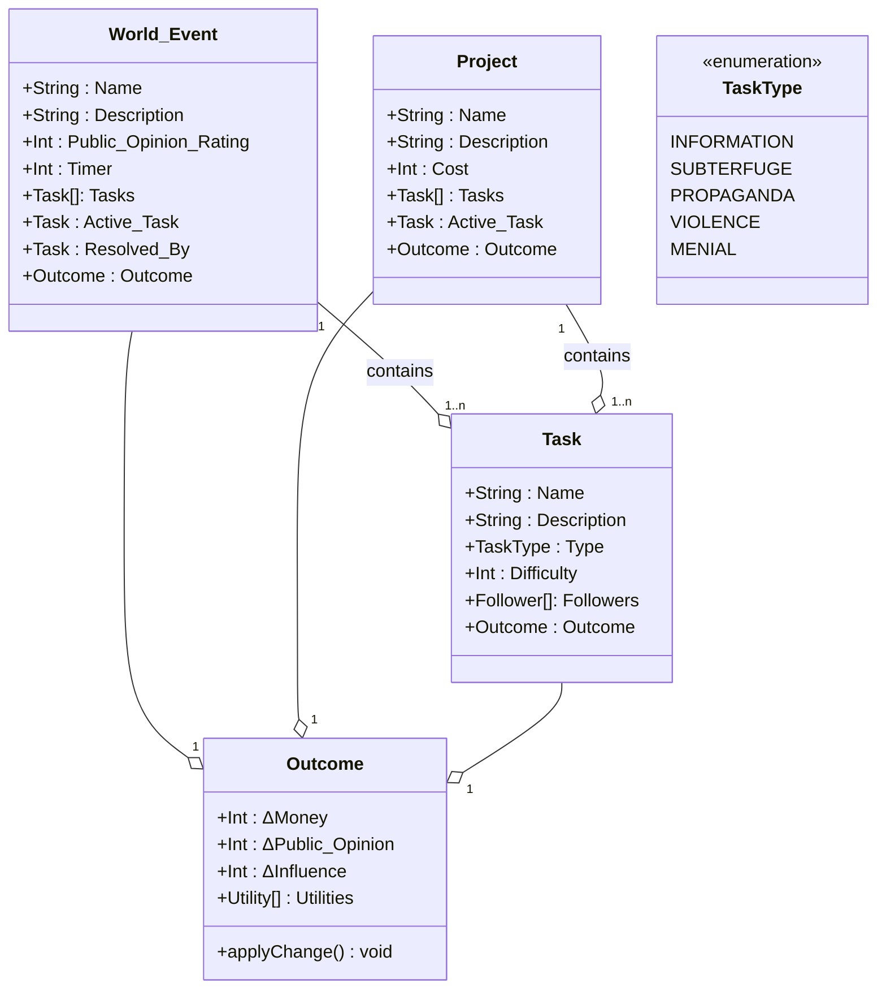

```mermaid
classDiagram
%% Classes
    class World_Event {
      +String : Name
      +String : Description
      +Int : Public_Opinion_Rating
      +Int : Timer
      +Task[]: Tasks
      +Task : Active_Task
      +Task : Resolved_By
      +Outcome : Outcome
    }

    class Project {
      +String : Name
      +String : Description
      +Int : Cost
      +Task[] : Tasks
      +Task : Active_Task
      +Outcome : Outcome
    }

    class Task {
      +String : Name
      +String : Description
      +TaskType : Type
      +Int : Difficulty
      +Follower[]: Followers
      +Outcome : Outcome
    }

    class Outcome {
      +Int : ΔMoney
      +Int : ΔPublic_Opinion
      +Int : ΔInfluence
      +Utility[] : Utilities

      +applyChange() void
    }

    class TaskType {
      <<enumeration>>
      INFORMATION
      SUBTERFUGE
      PROPAGANDA
      VIOLENCE
      MENIAL
    }

%% Relationships go here
  World_Event --o "1" Outcome
  Project --o "1" Outcome
  Task --o "1" Outcome

  World_Event "1" --o "1..n" Task : contains
  Project "1" --o "1..n" Task : contains


```
