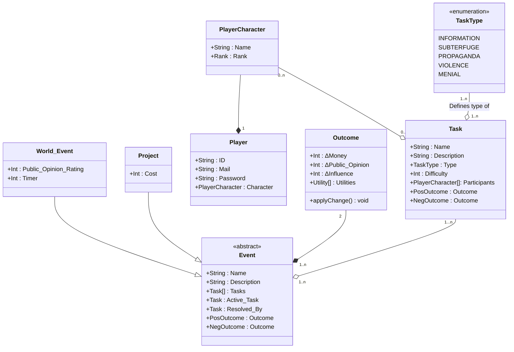

```mermaid
classDiagram
  direction TB

%% Classes
  class Event {
    <<abstract>>
    +String : Name
    +String : Description
    +Task[] : Tasks
    +Task : Active_Task
    +Task : Resolved_By
    +PosOutcome : Outcome
    +NegOutcome : Outcome
  }

  class World_Event {
    +Int : Public_Opinion_Rating
    +Int : Timer
  }

  class Project {
    +Int : Cost
  }

  class Task {
    +String : Name
    +String : Description
    +TaskType : Type
    +Int : Difficulty
    +PlayerCharacter[]: Participants
    +PosOutcome : Outcome
    +NegOutcome : Outcome
  }

  class Outcome {
    +Int : ΔMoney
    +Int : ΔPublic_Opinion
    +Int : ΔInfluence
    +Utility[] : Utilities

    +applyChange() void
  }

  class Player {
    +String : ID
    +String : Mail
    +String : Password
    +PlayerCharacter : Character
  }

  class PlayerCharacter {
    +String : Name
    +Rank : Rank
  }


%% Generics Enums and such
  class TaskType {
    <<enumeration>>
    INFORMATION
    SUBTERFUGE
    PROPAGANDA
    VIOLENCE
    MENIAL
  }

%% Relationships go here
  Project --|> Event
  World_Event --|> Event

  Outcome "2" --* "1..n" Event

  Task "1...n" --o "1..n" Event

  PlayerCharacter --* "1" Player
  PlayerCharacter "0..n" --o "0..n" Task

  TaskType "1..n" --o "1..n" Task : Defines type of

```