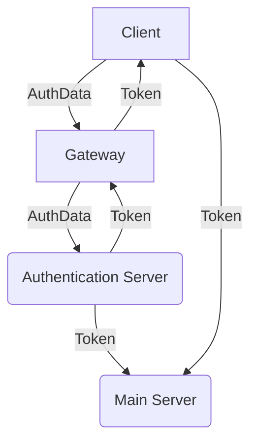
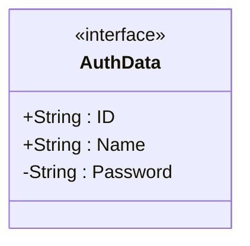

# Social Logins
Social logins ist die bevorzugte Variante (aka Sign In with Google etc.)

Einige Provider bieten services die solche Integrationen leicht möglich machen:

- [Auth0](https://auth0.com/de)
- [Firebase Authentication](https://cloud.google.com/appengine/docs/standard/python/authenticating-users-firebase-appengine)

Alternativ bieten diese auch Login via Email oder Telefon und wahlweise Two-Factor-Authentication.

# Basic Server Setup

*Könnte etwas overkill für Prototyp sein aber sollte zusammen mit gutem hashing zu einer relativ sicheren Struktur führen.*

